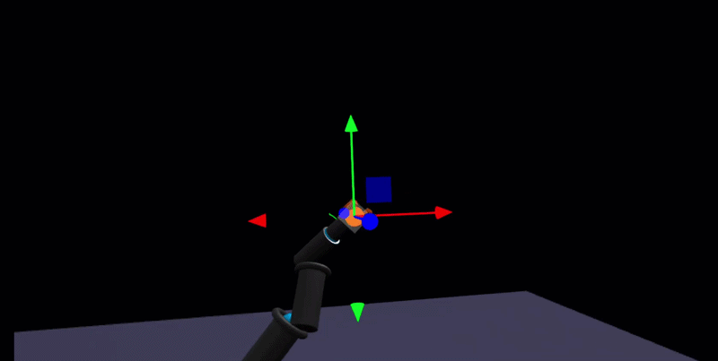
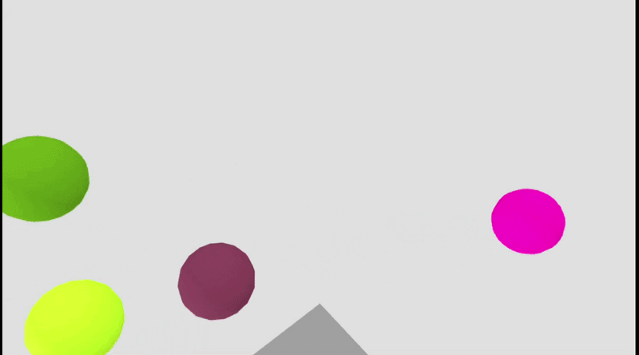

# Interactive WebXR Visualization Platform

A modular WebXR & WebGL demo app built with **Three.js**. Pick a world from the landing page and run it in desktop or VR—360° video, depth panoramas, instanced rendering, hand tracking, and a **teleoperated IK arm** with CCD inverse kinematics.



---

## Features

### Worlds

| World | Description |
|-------|-------------|
| **Video in VR** | 360° video on a sphere. Local file or streamed presets (chunked HTTP). A/D rotate on desktop; look around in VR. |
| **InDepth Panorama** | Equirectangular panorama + depth map for 3D parallax (custom shaders). |
| **Panorama** | Single equirectangular 360° image on a sphere. |
| **Floating Shapes** | Instanced meshes for performance (one draw call for many objects). Click to push; +/- count. Optional AR. |
| **Hand Tracking** | WebXR hand tracking: left pinch spawn, right pinch grab. Box hand model. |
| **IK Arm Reach** | 4-link arm with CCD IK. Desktop: gizmo + A/D orbit + Spacebar gripper. VR: right-hand target + thumb–middle pinch gripper + trigger reset. |

#### World previews (add your GIFs here)

| World | Preview |
|-------|---------|
| Video in VR |  |
| InDepth Panorama |  |
| Floating Shapes |  |
| Hand Tracking |  |
| IK Arm Reach |  |

---

## Tech stack

- **Three.js** (r160) – scene graph, WebGL, XR
- **WebXR Device API** – VR (and optional AR) sessions
- **WebGL 2** – rendering
- **ES modules** – no bundler required for development
- **Optional:** cannon-es (if AR physics world is re-enabled)

---

## Run locally

1. **Serve over HTTPS** (required for WebXR). Examples:
   - `npx serve .` (from this directory)
   - `python -m http.server 8080` with a tunnel (e.g. ngrok) for HTTPS
2. Open the URL in a browser (Chrome/Edge recommended for WebXR).
3. Put on a VR headset and use **Enter VR** when prompted, or use desktop mode.

**VR:** Hand tracking needs `optionalFeatures: ['hand-tracking']` in the session (already configured where used).

---

## Project structure

```
WebXR/
├── index.html          # Landing page, UI, canvas container
├── js/
│   ├── main.js         # Scene, renderer, XR button, world switching
│   ├── WorldManager.js # World list, session types, info panel texts
│   └── worlds/
│       ├── VideoWorld.js
│       ├── InDepthWorld.js
│       ├── PanoramaWorld.js
│       ├── FloatingShapesWorld.js
│       ├── HandTrackingWorld.js
│       └── IKArmWorld.js
├── assets/             # Local 360° video, etc.
├── docs/                # Add GIFs here: gif-video-in-vr.gif, gif-indepth-panorama.gif, etc.
└── README.md
```

---

## World Manager: how to add a new world

The app uses a **World Manager** that loads one world at a time. Each world is an isolated 3D environment with its own `enter`, `exit`, and optional `update`. To add a new world:

### 1. Create the world class

Add a new file in `js/worlds/`, e.g. `js/worlds/MyWorld.js`:

```js
import * as THREE from 'three';

export class MyWorld {
    constructor() {
        this.mesh = null;  // keep refs for cleanup
    }

    enter(scene, renderer, camera) {
        // Build your scene: lights, meshes, etc. Add to scene.
        const geom = new THREE.BoxGeometry(0.5, 0.5, 0.5);
        const mat = new THREE.MeshBasicMaterial({ color: 0xff0000 });
        this.mesh = new THREE.Mesh(geom, mat);
        scene.add(this.mesh);
    }

    exit(scene) {
        // Remove everything and dispose geometries/materials.
        if (this.mesh) {
            scene.remove(this.mesh);
            this.mesh.geometry.dispose();
            this.mesh.material.dispose();
            this.mesh = null;
        }
    }

    update(time, frame, renderer, scene, camera) {
        // Optional: per-frame logic (animation, input, etc.)
    }
}
```

- **`enter(scene, renderer, camera)`** – Called when switching to this world. Add your objects to `scene`.
- **`exit(scene)`** – Called when leaving. Remove objects and call `.dispose()` on geometries/materials to avoid leaks.
- **`update(time, frame, renderer, scene, camera)`** – Optional. Called every frame while this world is active.

### 2. Register the world in WorldManager

In `js/WorldManager.js`:

1. **Import** your class at the top:
   ```js
   import { MyWorld } from './worlds/MyWorld.js';
   ```

2. **Append** to the four arrays (same index for one world):
   - `worldClasses` – the class (e.g. `MyWorld`)
   - `worldNames` – display name (e.g. `"My World"`)
   - `worldSessionTypes` – `'vr'` or `'ar'`
   - `worldInfoTexts` – `{ title: 'My World', content: 'Description and controls.\n\nControls (Desktop)\n- ...' }`

Example for a new world at index 6:

```js
this.worldClasses = [ ..., MyWorld ];
this.worldNames = [ ..., "My World" ];
this.worldSessionTypes = [ ..., 'vr' ];  // or 'ar'
this.worldInfoTexts = [
    ...,
    { title: 'My World', content: 'What it does.\n\nControls (Desktop)\n- Keys / mouse.\n\nControls (VR)\n- ...' }
];
```

### 3. Add a landing-page button

In `index.html`, inside `#landing-world-buttons`, add a button with `data-world-index` set to your world’s index (e.g. `6`):

```html
<button type="button" class="world-entry-btn" data-world-index="6">🆕 My World <span class="btn-tag">Tag</span></button>
```

After that, your world appears on the landing page and loads when the user clicks it. Use **Switch World** in-app to cycle through all worlds.

---

## License

This project is **open source** so you can use it, modify it, and **create new worlds** or fork the repo without asking. The **MIT License** means:

- You can use the code for personal or commercial projects.
- You can change it and add new worlds.
- You need to keep the license notice if you redistribute.

No other restrictions. If you add a world, you’re not required to contribute it back—but pull requests with new worlds or fixes are welcome.
